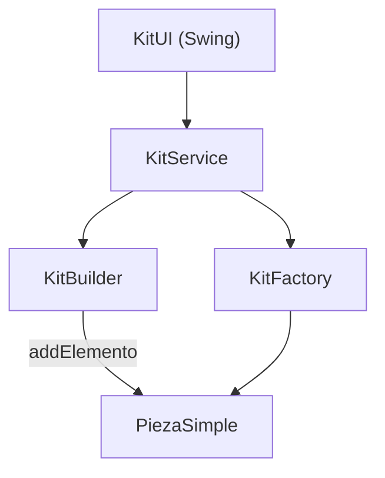
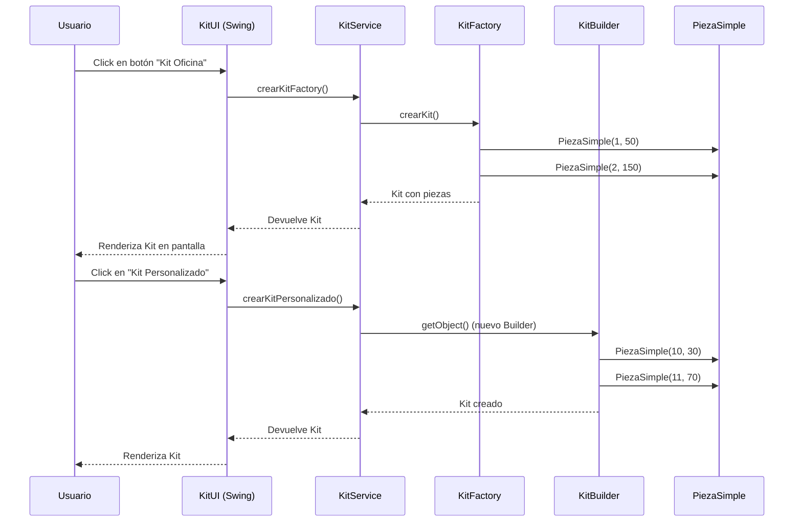

# Generador de Kits de Piezas

  

## Tabla de Contenidos
1. [Descripción General](#descripción-general)  
2. [Arquitectura del Sistema](#arquitectura-del-sistema)  
3. [Estructura del Proyecto](#estructura-del-proyecto)  
4. [Módulos y Paquetes](#módulos-y-paquetes)  
5. [Flujo de Operaciones](#flujo-de-operaciones)  
6. [Arranque y Configuración](#arranque-y-configuración)  
7. [Uso de la Interfaz](#uso-de-la-interfaz)  
8. [Principios de Diseño](#principios-de-diseño)  
9. [Dependencias](#dependencias)  
10. [Roadmap & Futuras Mejoras](#roadmap--futuras-mejoras)  
11. [Contribución](#contribución)  
12. [Licencia](#licencia)  

---

## Descripción General

**Generador de Kits de Piezas** es una aplicación de escritorio en Java que permite crear, visualizar y gestionar kits de piezas mediante dos patrones de diseño:

- **Factory Method**: para kits predefinidos con descuento fijo.  
- **Builder**: para crear kits personalizados de forma flexible.

El sistema separa la lógica de negocio con Spring Boot y presenta una interfaz gráfica minimalista en Swing. Ideal como práctica educativa de patrones GoF y control de estado en aplicaciones desktop.

---

## Arquitectura del Sistema



---

## Estructura del Proyecto

```
src/
├── main/
│   ├── java/com/example/kits/
│   │   ├── KitsApplication.java
│   │   ├── factory/
│   │   ├── builder/
│   │   ├── model/
│   │   ├── service/
│   │   └── ui/
│   └── resources/
│       └── application.properties
└── test/
    └── java/com/example/kits/
```

---

## Módulos y Paquetes

| Paquete      | Descripción                                              |
|--------------|----------------------------------------------------------|
| `factory`    | Crea instancias fijas de `Kit` mediante `KitFactoryImpl` |
| `builder`    | Lógica del patrón Builder para construir `Kit` por pasos |
| `model`      | Clases de dominio (`Kit`, `Pieza`, `PiezaSimple`)        |
| `service`    | `KitService`: puente entre UI y Factory/Builder          |
| `ui`         | Interfaz gráfica Swing, botones y renderización de kits  |

---

## Flujo de Operaciones



---

## Arranque y Configuración

1. **Clonar el repositorio**  
   ```bash
   git clone https://github.com/tu-usuario/generador-kits.git
   cd generador-kits
   ```

2. **Compilar y ejecutar**  
   ```bash
   mvn clean install
   mvn spring-boot:run -Dspring-boot.run.jvmArguments="-Djava.awt.headless=false"
   ```

---

## Uso de la Interfaz

1. **Kit Oficina (Factory)**  
   Pulsa el botón "Kit Oficina" para generar un kit predefinido con dos piezas simples y descuento fijo.

2. **Kit Personalizado (Builder)**  
   Pulsa "Kit Personalizado" para construir un kit de prueba con dos piezas con códigos (10, 11).

3. **Panel de Resultados**  
   Cada kit generado se muestra con su código, componentes y precio final (incluye descuento si lo hay).

---

## Principios de Diseño

- **SOLID**: Clases separadas por responsabilidad (UI, lógica, dominio).  
- **Inyección de Dependencias** con Spring (`@Autowired`, `@Component`, `@Scope`).  
- **Patrones GoF**:  
  - *Factory Method*: `KitFactoryImpl`  
  - *Builder*: `KitBuilder` con encadenamiento fluido  
- **Swing** desacoplado de lógica de negocio (usa `KitService` como fachada).

---

## Dependencias

- **Spring Boot Starter** (contexto y gestión de beans)  
- **Java AWT/Swing** (interfaz de usuario)  
- **Lombok** (constructores, getters/setters automáticos)  
- **JUnit 5** (tests unitarios y de integración)

---

## Roadmap & Futuras Mejoras

- 🧩 Formulario interactivo para añadir piezas al kit personalizado.  
- 💾 Persistencia de kits en BD (H2 o SQLite).  
- 🌐 Versión web con Thymeleaf o React.  
- 🎨 Estilización visual del UI con colores, íconos y temas.  
- 📦 Carga de kits desde archivo JSON o XML.

---

## Contribución

1. Haz fork del proyecto.  
2. Crea una rama `feature/nombre-feature`.  
3. Asegúrate de cubrir tu código con pruebas.  
4. Envía tu *pull request* describiendo el cambio.

---

## Licencia

Este proyecto está bajo la **Licencia MIT**.  
Consulta el archivo [LICENSE](LICENSE) para más información.
